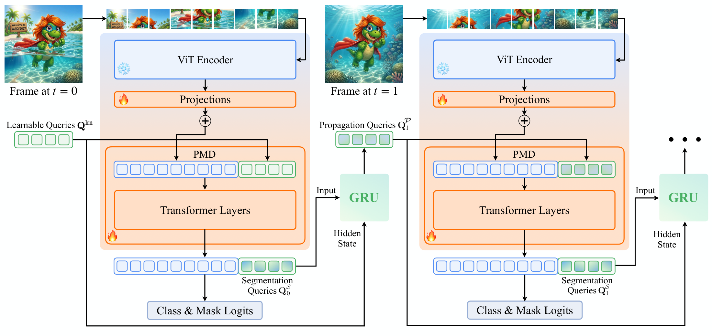

# LVMT: Video Mask Transformer for Long-term Video Segmentation
**[📄 Paper](?)**

**[Narges Norouzi](https://scholar.google.com/citations?user=q7sm490AAAAJ)<sup>1</sup>, [Niccolò Cavagnero](https://scholar.google.com/citations?user=Pr4XHRAAAAAJ)<sup>1</sup>, [Idil Esen Zulfikar](https://scholar.google.com/citations?user=89vcmSoAAAAJ&hl=en)<sup>2</sup>, [Bastian Leibe](https://scholar.google.com/citations?user=ZcULDB0AAAAJ)<sup>2</sup>, [Gijs Dubbelman](https://scholar.google.nl/citations?user=wy57br8AAAAJ)<sup>1</sup>, [Daan de Geus](https://ddegeus.github.io)<sup>1</sup>**

¹ Eindhoven University of Technology,
² RWTH Aachen University

## Overview

<h3 align="center">Long-term memory. No speed penalty.</h3>
<p align="center">
<b>+4.6 AP</b> over PMT across ViT-L/B/S on OVIS, at similar FPS.<br>
<b>+2.4 AP</b> over the prior state-of-the-art, DVIS-DAQ, at over <b>10&times</b> its speed.
</p>



We introduce the **Long-term Video Mask Transformer (LVMT)**, an online video segmentation model built on a **frozen** plain Vision Transformer (ViT). A single lightweight mask decoder handles both segmentation and temporal association, without relying on dedicated tracking modules or heavy task-specific heads.

LVMT propagates information over time with **Truncated Query Propagation (TQP)**: a GRU updates each object query independently, so every query carries its own memory across frames, and training splits long clips into chunks that keep gradients bounded while the propagated state still spans the whole clip. This lets the memory be trained on videos long enough for objects to be occluded and re-appear, which is where per-frame baselines lose track.

## Installation

If you don't have Conda installed, install Miniconda and restart your shell:

```bash
wget https://repo.anaconda.com/miniconda/Miniconda3-latest-Linux-x86_64.sh
bash Miniconda3-latest-Linux-x86_64.sh
```

Then create the environment, activate it, and install the dependencies:

```bash
conda create -n lvmt python==3.13.2
conda activate lvmt
pip install torch==2.9.0 torchvision==0.24.0 --index-url https://download.pytorch.org/whl/cu128
python -m pip install --no-build-isolation 'git+https://github.com/facebookresearch/detectron2.git'
pip install git+https://github.com/cocodataset/panopticapi.git
python3 -m pip install -r requirements.txt
```

[Weights & Biases](https://wandb.ai/) (wandb) is used for experiment logging and visualization. To enable wandb, log in to your account:

```bash
wandb login
```

## Data preparation

[Download and prepare the datasets.](datasets/README.md)

## Usage

### Evaluation

To evaluate a pre-trained LVMT model, first prepare the datasets by following the instructions in this [link](datasets/README.md) and download the trained weights from [DINOv2 models](model_zoo/dinov2.md) or [DINOv3 models](model_zoo/dinov3.md). Once these are set up, run:

```bash
python train_net_video.py \
  --num-gpus 1 \
  --config-file /path/to/config.yaml \
  --eval-only MODEL.WEIGHTS /path/to/weight.pth \
  MODEL.BACKBONE.TEST.WINDOW_SIZE 1 \
  OUTPUT_DIR /path/to/output
```

🔧 Replace `/path/to/config.yaml` with the path to the config file.  
🔧 Replace `/path/to/weight.pth` with the path to the checkpoint to evaluate.  
🔧 Replace `/path/to/output` with the path to the output folder.  
🔧 Change the value of `--num-gpus` to the number of GPUs available to you.

For detailed instructions on running evaluation on different datasets, see [Evaluation](model_zoo/evaluation.md).

<!--
### Training

Train the online LVMT model with Truncated Query Propagation, initialized from a segmenter
checkpoint (see the `Init Weights` column of [DINOv2 Models](model_zoo/dinov2.md) and
[DINOv3 Models](model_zoo/dinov3.md)):

```bash
python3 train_net_video.py \
  --num-gpus 4 \
  --num-machines 2 \
  --config-file configs/ytvis19/lvmt/vit-large/lvmt_online_ViTL_tqp.yaml \
  INPUT.SAMPLING_FRAME_NUM 15 \
  INPUT.SAMPLING_FRAME_RANGE 5 \
  MODEL.BACKBONE.TQP_CHUNK_SIZE 5 \
  MODEL.WEIGHTS /path/to/segmenter_weight.pth \
  OUTPUT_DIR /path/to/output
```

Replace `/path/to/segmenter_weight.pth` with the segmenter checkpoint used to initialize training.

Replace `/path/to/output` with the directory where training logs and checkpoints should be written.

`INPUT.SAMPLING_FRAME_NUM` sets the clip length seen per optimizer step, and
`MODEL.BACKBONE.TQP_CHUNK_SIZE` sets the chunk size `F` — the number of frames gradients flow
through before the query state is detached. Setting `MODEL.BACKBONE.TQP_CHUNK_SIZE 0` disables
TQP and backpropagates over the whole clip at once.

-->

### Benchmark

To calculate the FPS and GFLOPs, run:

```bash
# DINOv2 FPS
python benchmark.py \
  --task fps \
  --config-file    /path/to/config.yaml \
  --model-weights  /path/to/weight.pth \
  --warmup-iters 100 \
  --model-type dinov2 \
  --fused-qkv

# DINOv3 FPS
python benchmark.py \
  --task fps \
  --config-file    /path/to/config.yaml \
  --model-weights  /path/to/weight.pth \
  --warmup-iters 100 \
  --model-type dinov3 \
  --fused-qkv

# DINOv2 GFLOPs
export TIMM_FUSED_ATTN=0
python benchmark.py \
  --task flops \
  --config-file    /path/to/config.yaml \
  --model-weights  /path/to/weight.pth \
  --model-type dinov2

# DINOv3 GFLOPs
python benchmark.py \
  --task flops \
  --config-file    /path/to/config.yaml \
  --model-weights  /path/to/weight.pth \
  --model-type dinov3
```

<!-- For DINOv3 FPS benchmarking, enable `--fused-qkv`. This is recommended to get FPS closer to the DINOv2 setup. -->

🔧 Replace `/path/to/config.yaml` with the path to the config file.  
🔧 Replace `/path/to/weight.pth` with the path to the checkpoint to evaluate.

## Demo

We provide example visualizations below.


<!-- 
To generate additional visualization samples, please use the code in [Visualization](model_zoo/visualization.md). -->

## Upcoming Features

```
- [x] Inference code
- [x] Flops and FPS code
- [x] DINOv2 and DINOv3 model zoo and code
- [ ] Visualization code
- [ ] Training code
```

## Model Zoo

We provide pre-trained weights for both DINOv2- and DINOv3-based LVMT models.

- **[DINOv2 Models](model_zoo/dinov2.md)** - DINOv2-based models and pre-trained weights.
- **[DINOv3 Models](model_zoo/dinov3.md)** - DINOv3-based models and pre-trained weights.

## Citation
If you find this work useful in your research, please cite it using the BibTeX entry below:

```BibTeX
@article{Norouzi2026LVMT,
  author    = {Norouzi, Narges and Cavagnero, Niccol\`{o} and Zulfikar, Idil and Leibe, Bastian and Dubbelman, Gijs and {de Geus}, Daan},
  title     = {{LVMT: Video Mask Transformer for Long-term Video Segmentation}},
  journal   = {arXiv},
  year      = {2026},
}
```

## Acknowledgements

This project builds upon code from the following libraries and repositories:
- [EoMT](https://github.com/tue-mps/eomt) (MIT License)
- [VidEoMT](https://github.com/tue-mps/videomt) (MIT License)
- [PMT](https://github.com/tue-mps/pmt) (MIT License)
- [Hugging Face Transformers](https://github.com/huggingface/transformers) (Apache-2.0 License)
- [PyTorch Image Models (timm)](https://github.com/huggingface/pytorch-image-models) (Apache-2.0 License)
- [CAVIS](https://github.com/Seung-Hun-Lee/CAVIS) (MIT License)
- [Mask2Former](https://github.com/facebookresearch/Mask2Former) (Apache-2.0 License)
- [Detectron2](https://github.com/facebookresearch/detectron2) (Apache-2.0 License)
